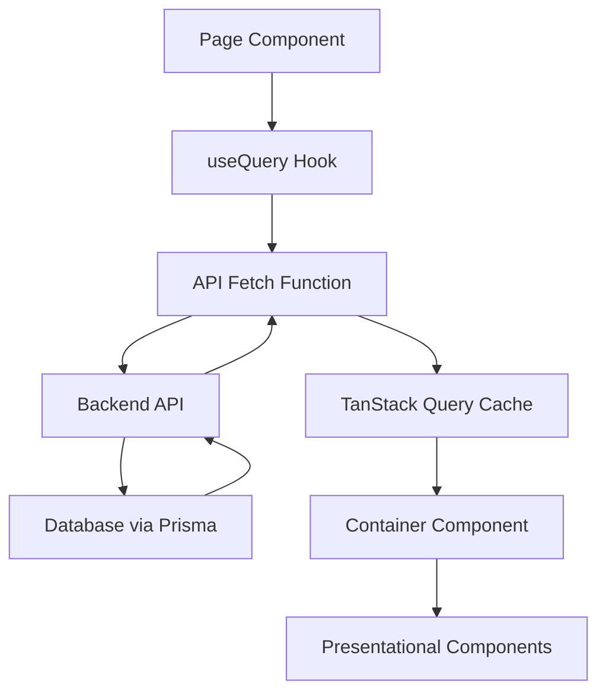

# SuperAdmin Component Architecture Guide

## Table of Contents

1. [Architecture Overview](#architecture-overview)
2. [Component Structure](#component-structure)
3. [Data Flow Patterns](#data-flow-patterns)
4. [TanStack Query Implementation](#tanstack-query-implementation)
5. [State Management](#state-management)
6. [Component Patterns](#component-patterns)
7. [Type Safety](#type-safety)

---

## Architecture Overview

The SuperAdmin interface follows a modular, component-based architecture built with Next.js 14, TypeScript, and TanStack Query for efficient data management.

### Key Architectural Principles

1. **Separation of Concerns**: Components are organized by feature and responsibility
2. **Data-Driven Design**: All components consume data through standardized interfaces
3. **Type Safety**: Full TypeScript coverage with Prisma-generated types
4. **Performance**: Optimized data fetching with caching and background updates
5. **Maintainability**: Consistent patterns and clear component boundaries

### Directory Structure

```
src/app/superadmin/
├── [superadminId]/
│   ├── dashboard/
│   │   └── page.tsx                 # Dashboard route
│   ├── elections/
│   │   ├── page.tsx                 # Elections list
│   │   └── [electionId]/
│   │       └── page.tsx             # Election details
│   ├── analytics/
│   │   ├── page.tsx                 # Analytics overview
│   │   └── [electionId]/
│   │       └── page.tsx             # Election-specific analytics
│   ├── subadmins/
│   │   └── page.tsx                 # Admin management
│   ├── approvals/
│   │   └── page.tsx                 # Election approvals
│   ├── audit-logs/
│   │   └── page.tsx                 # Audit trail
│   └── settings/
│       └── page.tsx                 # System settings
├── layout.tsx                       # SuperAdmin layout
└── page.tsx                         # SuperAdmin entry point

src/app/components/ui/superadmin/
├── dashboard/
│   ├── DashboardContainer.tsx       # Main dashboard component
│   ├── DashboardSummaryCards.tsx   # Overview statistics
│   ├── QuickActions.tsx             # Quick action buttons
│   ├── RecentActivity.tsx           # Recent activity feed
│   ├── UpcomingElections.tsx        # Upcoming elections widget
│   ├── SystemHealth.tsx             # System status widget
│   └── DashboardShimmer.tsx         # Loading skeleton
├── elections/
│   ├── ElectionsContainer.tsx       # Elections list component
│   └── ElectionsShimmer.tsx         # Loading skeleton
└── analytics/
    ├── AnalyticsContainer.tsx       # Analytics component
    └── AnalyticsShimmer.tsx         # Loading skeleton
```

---

## Component Structure

### Page Components (Routes)

Page components handle routing, authentication checks, data fetching, and error boundaries.

**Pattern:**

```tsx
// src/app/superadmin/[superadminId]/dashboard/page.tsx
"use client";

import React from "react";
import { useParams } from "next/navigation";
import { useQuery } from "@tanstack/react-query";
import DashboardContainer from "@/app/components/ui/superadmin/dashboard/DashboardContainer";
import DashboardShimmer from "@/app/components/ui/superadmin/dashboard/DashboardShimmer";

const fetchDashboardData = async (superadminId: string) => {
  // API call logic
  const response = await fetch(`/api/superadmin/dashboard?id=${superadminId}`);
  if (!response.ok) throw new Error("Failed to fetch dashboard data");
  return response.json();
};

export default function SuperAdminDashboard() {
  const params = useParams();
  const superadminId = params.superadminId as string;

  const { data, isLoading, error, refetch } = useQuery({
    queryKey: ["superadmin-dashboard", superadminId],
    queryFn: () => fetchDashboardData(superadminId),
    staleTime: 5 * 60 * 1000, // 5 minutes
    refetchInterval: 30 * 1000, // 30 seconds
  });

  if (error) {
    return (
      <div className="p-6">
        <div className="text-center">
          <h2 className="text-2xl font-bold text-red-600 mb-4">
            Error Loading Dashboard
          </h2>
          <p className="text-gray-600 mb-4">
            {error instanceof Error
              ? error.message
              : "An unexpected error occurred"}
          </p>
          <button onClick={() => refetch()} className="btn btn-primary">
            Try Again
          </button>
        </div>
      </div>
    );
  }

  if (isLoading || !data) {
    return <DashboardShimmer />;
  }

  return <DashboardContainer dashboardData={data} />;
}
```

### Container Components

Container components handle data presentation, user interactions, and state management.

**Pattern:**

```tsx
// src/app/components/ui/superadmin/dashboard/DashboardContainer.tsx
"use client";

import React from "react";
import { DashboardResponse } from "@/types/prisma";
import DashboardSummaryCards from "./DashboardSummaryCards";
import QuickActions from "./QuickActions";
import RecentActivity from "./RecentActivity";
import UpcomingElections from "./UpcomingElections";
import SystemHealth from "./SystemHealth";

interface DashboardContainerProps {
  dashboardData: DashboardResponse;
}

export default function DashboardContainer({
  dashboardData,
}: DashboardContainerProps) {
  const {
    superadminId,
    overview,
    recentActivity,
    upcomingElections,
    systemHealth,
  } = dashboardData;

  return (
    <div className="space-y-6 p-6">
      {/* Header */}
      <div className="flex justify-between items-center">
        <h1 className="text-3xl font-bold text-gray-900">Dashboard</h1>
        <div className="text-sm text-gray-500">
          Last updated: {new Date().toLocaleTimeString()}
        </div>
      </div>

      {/* Summary Cards */}
      <DashboardSummaryCards overview={overview} />

      <div className="grid grid-cols-1 lg:grid-cols-3 gap-6">
        {/* Quick Actions */}
        <div className="lg:col-span-1">
          <QuickActions superadminId={superadminId} />
          <div className="mt-6">
            <SystemHealth systemHealth={systemHealth} />
          </div>
        </div>

        {/* Main Content */}
        <div className="lg:col-span-2 space-y-6">
          <RecentActivity activities={recentActivity} />
          <UpcomingElections elections={upcomingElections} />
        </div>
      </div>
    </div>
  );
}
```

### Presentational Components

Focused, reusable components that handle specific UI concerns.

**Pattern:**

```tsx
// src/app/components/ui/superadmin/dashboard/DashboardSummaryCards.tsx
"use client";

import React from "react";
import { Card, CardContent, CardHeader, CardTitle } from "@/components/ui/card";
import { TrendingUp, Users, Vote, Calendar } from "lucide-react";

interface OverviewData {
  totalElections: number;
  activeElections: number;
  completedElections: number;
  pendingElections: number;
  draftElections: number;
  totalVotes: number;
  totalUsers: number;
  totalAdmins: number;
}

interface DashboardSummaryCardsProps {
  overview: OverviewData;
}

export default function DashboardSummaryCards({
  overview,
}: DashboardSummaryCardsProps) {
  const cards = [
    {
      title: "Total Elections",
      value: overview.totalElections,
      icon: Calendar,
      color: "text-blue-600",
      bgColor: "bg-blue-50",
    },
    {
      title: "Active Elections",
      value: overview.activeElections,
      icon: TrendingUp,
      color: "text-green-600",
      bgColor: "bg-green-50",
    },
    {
      title: "Total Votes",
      value: overview.totalVotes.toLocaleString(),
      icon: Vote,
      color: "text-amber-600",
      bgColor: "bg-amber-50",
    },
    {
      title: "Total Users",
      value: overview.totalUsers.toLocaleString(),
      icon: Users,
      color: "text-purple-600",
      bgColor: "bg-purple-50",
    },
  ];

  return (
    <div className="grid grid-cols-1 md:grid-cols-2 lg:grid-cols-4 gap-6">
      {cards.map((card, index) => {
        const IconComponent = card.icon;
        return (
          <Card key={index} className="hover:shadow-lg transition-shadow">
            <CardHeader className="flex flex-row items-center justify-between pb-2">
              <CardTitle className="text-sm font-medium text-gray-600">
                {card.title}
              </CardTitle>
              <div className={`p-2 rounded-lg ${card.bgColor}`}>
                <IconComponent className={`h-4 w-4 ${card.color}`} />
              </div>
            </CardHeader>
            <CardContent>
              <div className="text-2xl font-bold text-gray-900">
                {card.value}
              </div>
            </CardContent>
          </Card>
        );
      })}
    </div>
  );
}
```

### Loading Components (Shimmers)

Skeleton components that provide visual feedback during data loading.

**Pattern:**

```tsx
// src/app/components/ui/superadmin/dashboard/DashboardShimmer.tsx
"use client";

import React from "react";
import { Card, CardContent, CardHeader } from "@/components/ui/card";

export default function DashboardShimmer() {
  return (
    <div className="space-y-6 p-6 animate-pulse">
      {/* Header */}
      <div className="flex justify-between items-center">
        <div className="h-8 bg-gray-300 rounded w-48"></div>
        <div className="h-4 bg-gray-300 rounded w-32"></div>
      </div>

      {/* Summary Cards */}
      <div className="grid grid-cols-1 md:grid-cols-2 lg:grid-cols-4 gap-6">
        {[...Array(4)].map((_, i) => (
          <Card key={i} className="overflow-hidden">
            <CardHeader className="pb-2">
              <div className="flex justify-between items-center">
                <div className="h-4 bg-gray-300 rounded w-20"></div>
                <div className="h-8 w-8 bg-gray-300 rounded"></div>
              </div>
            </CardHeader>
            <CardContent>
              <div className="h-8 bg-gray-300 rounded w-16"></div>
            </CardContent>
          </Card>
        ))}
      </div>

      {/* Content Grid */}
      <div className="grid grid-cols-1 lg:grid-cols-3 gap-6">
        {/* Sidebar */}
        <div className="space-y-6">
          <Card>
            <CardHeader>
              <div className="h-6 bg-gray-300 rounded w-32"></div>
            </CardHeader>
            <CardContent className="space-y-3">
              {[...Array(4)].map((_, i) => (
                <div key={i} className="h-10 bg-gray-300 rounded"></div>
              ))}
            </CardContent>
          </Card>
        </div>

        {/* Main Content */}
        <div className="lg:col-span-2 space-y-6">
          {[...Array(2)].map((_, i) => (
            <Card key={i}>
              <CardHeader>
                <div className="h-6 bg-gray-300 rounded w-40"></div>
              </CardHeader>
              <CardContent className="space-y-4">
                {[...Array(5)].map((_, j) => (
                  <div key={j} className="flex items-center space-x-4">
                    <div className="h-4 w-4 bg-gray-300 rounded"></div>
                    <div className="flex-1">
                      <div className="h-4 bg-gray-300 rounded w-3/4 mb-2"></div>
                      <div className="h-3 bg-gray-300 rounded w-1/2"></div>
                    </div>
                    <div className="h-3 bg-gray-300 rounded w-16"></div>
                  </div>
                ))}
              </CardContent>
            </Card>
          ))}
        </div>
      </div>
    </div>
  );
}
```

---

## Data Flow Patterns

### 1. Server State Management with TanStack Query



### 2. Data Fetching Pattern

```tsx
// Standard data fetching pattern used across all pages
const fetchData = async (params: DataFetchParams) => {
  const queryString = new URLSearchParams(params).toString();
  const response = await fetch(`/api/endpoint?${queryString}`);

  if (!response.ok) {
    throw new Error(`HTTP error! status: ${response.status}`);
  }

  const result = await response.json();

  if (!result.success) {
    throw new Error(result.error?.message || "API request failed");
  }

  return result.data;
};

const useDataQuery = (params: DataFetchParams) => {
  return useQuery({
    queryKey: ["data-key", params],
    queryFn: () => fetchData(params),
    staleTime: 5 * 60 * 1000, // 5 minutes
    gcTime: 10 * 60 * 1000, // 10 minutes
    refetchOnWindowFocus: false,
    retry: (failureCount, error) => {
      // Don't retry on 404 or 403 errors
      if (
        error instanceof Error &&
        [404, 403].includes(Number(error.message))
      ) {
        return false;
      }
      return failureCount < 3;
    },
  });
};
```

### 3. Component Data Flow

```
Page Component
    ├── Data Fetching (useQuery)
    ├── Loading State (Shimmer Component)
    ├── Error State (Error Boundary)
    └── Success State (Container Component)
        ├── Data Processing
        ├── State Management (local state)
        └── Child Components
            ├── Presentational Components
            ├── Interactive Components
            └── Nested Containers
```

---

## TanStack Query Implementation

### Query Configuration

All queries follow a standardized configuration:

```tsx
// Query keys follow a hierarchical pattern
const queryKey = [
  "feature", // Primary feature (e.g., 'dashboard', 'elections')
  "scope", // Scope identifier (e.g., superadminId, electionId)
  "params", // Additional parameters (filters, pagination)
];

// Example query keys:
// ['dashboard', 'superadmin-123']
// ['elections', 'list', { page: 1, status: 'LIVE' }]
// ['analytics', 'election-456']
// ['audit-logs', { userId: 'admin-123', page: 1 }]
```

### Cache Management

```tsx
// Cache invalidation patterns
const queryClient = useQueryClient();

// Invalidate related queries after mutations
const invalidateRelatedQueries = (scope: string) => {
  queryClient.invalidateQueries({ queryKey: ["dashboard", scope] });
  queryClient.invalidateQueries({ queryKey: ["elections"] });
  queryClient.invalidateQueries({ queryKey: ["analytics"] });
};

// Optimistic updates for immediate UI feedback
const useOptimisticUpdate = () => {
  return useMutation({
    mutationFn: updateData,
    onMutate: async (newData) => {
      await queryClient.cancelQueries({ queryKey: ["data"] });
      const previousData = queryClient.getQueryData(["data"]);
      queryClient.setQueryData(["data"], newData);
      return { previousData };
    },
    onError: (err, newData, context) => {
      queryClient.setQueryData(["data"], context?.previousData);
    },
    onSettled: () => {
      queryClient.invalidateQueries({ queryKey: ["data"] });
    },
  });
};
```

### Background Refetching

```tsx
// Strategic background updates for real-time data
const queries = {
  dashboard: {
    refetchInterval: 30 * 1000, // 30 seconds - high priority
    staleTime: 5 * 60 * 1000, // 5 minutes
  },
  elections: {
    refetchInterval: 60 * 1000, // 1 minute - medium priority
    staleTime: 10 * 60 * 1000, // 10 minutes
  },
  analytics: {
    refetchInterval: 5 * 60 * 1000, // 5 minutes - low priority
    staleTime: 15 * 60 * 1000, // 15 minutes
  },
  auditLogs: {
    refetchInterval: 2 * 60 * 1000, // 2 minutes - high priority for security
    staleTime: 30 * 1000, // 30 seconds
  },
};
```

---

## State Management

### 1. Server State (TanStack Query)

Handles all server-side data:

- API responses
- Cache management
- Background synchronization
- Error states
- Loading states

### 2. Client State (React State)

Handles local UI state:

- Form inputs
- Modal visibility
- Table sorting/filtering
- UI toggles

### 3. Global State (Zustand - if needed)

For cross-component state:

- User authentication
- Theme preferences
- Global UI state

### Example State Structure

```tsx
// Local component state
const [filters, setFilters] = useState({
  status: "all",
  search: "",
  page: 1,
});

// Server state via TanStack Query
const { data: elections, isLoading } = useQuery({
  queryKey: ["elections", filters],
  queryFn: () => fetchElections(filters),
});

// Derived state
const filteredElections = useMemo(() => {
  return (
    elections?.filter((election) =>
      election.title.toLowerCase().includes(filters.search.toLowerCase())
    ) || []
  );
}, [elections, filters.search]);
```

---

## Component Patterns

### 1. Compound Component Pattern

Used for complex components with multiple related parts:

```tsx
// Usage
<Dashboard>
  <Dashboard.Header title="SuperAdmin Dashboard" />
  <Dashboard.Summary data={overviewData} />
  <Dashboard.Content>
    <Dashboard.QuickActions />
    <Dashboard.RecentActivity />
  </Dashboard.Content>
</Dashboard>;

// Implementation
const Dashboard = ({ children }: { children: React.ReactNode }) => (
  <div className="dashboard-container">{children}</div>
);

Dashboard.Header = DashboardHeader;
Dashboard.Summary = DashboardSummary;
Dashboard.Content = DashboardContent;
Dashboard.QuickActions = QuickActions;
Dashboard.RecentActivity = RecentActivity;
```

### 2. Render Props Pattern

For flexible data sharing:

```tsx
interface DataProviderProps {
  children: (
    data: Data,
    loading: boolean,
    error: Error | null
  ) => React.ReactNode;
  queryKey: string[];
  queryFn: () => Promise<Data>;
}

const DataProvider = ({ children, queryKey, queryFn }: DataProviderProps) => {
  const { data, isLoading, error } = useQuery({ queryKey, queryFn });
  return children(data, isLoading, error);
};

// Usage
<DataProvider queryKey={["elections"]} queryFn={fetchElections}>
  {(elections, loading, error) =>
    loading ? (
      <ElectionsShimmer />
    ) : error ? (
      <ErrorComponent error={error} />
    ) : (
      <ElectionsContainer elections={elections} />
    )
  }
</DataProvider>;
```

### 3. Higher-Order Components (HOCs)

For cross-cutting concerns:

```tsx
// Authentication HOC
const withAuth = (
  WrappedComponent: React.ComponentType,
  requiredRole?: string
) => {
  return function AuthenticatedComponent(props: any) {
    const { user, isLoading } = useAuth();

    if (isLoading) return <LoadingSpinner />;

    if (!user || (requiredRole && user.role !== requiredRole)) {
      return <UnauthorizedComponent />;
    }

    return <WrappedComponent {...props} user={user} />;
  };
};

// Usage
export default withAuth(SuperAdminDashboard, "SUPERADMIN");
```

---

## Type Safety

### 1. Prisma-Generated Types

All database entities use Prisma-generated types:

```tsx
import { Election, User, Portfolio, Candidate } from "@/types/prisma";

// Ensures type safety with database schema
interface ElectionWithRelations extends Election {
  creator: User;
  portfolios: (Portfolio & {
    candidates: Candidate[];
  })[];
}
```

### 2. API Response Types

Standardized API response interfaces:

```tsx
interface ApiResponse<T> {
  success: boolean;
  data?: T;
  error?: ApiError;
  meta?: ResponseMeta;
}

interface DashboardApiResponse extends ApiResponse<DashboardResponse> {}
interface ElectionsApiResponse extends ApiResponse<ElectionsListResponse> {}
```

### 3. Component Prop Types

Strict typing for component props:

```tsx
interface DashboardContainerProps {
  dashboardData: DashboardResponse;
  onRefresh?: () => void;
  className?: string;
}

interface ElectionCardProps {
  election: ElectionWithDetails;
  onEdit?: (election: ElectionWithDetails) => void;
  onDelete?: (electionId: string) => void;
  showActions?: boolean;
}
```

### 4. Event Handler Types

Typed event handlers for better IntelliSense:

```tsx
type ElectionActionHandler = (election: ElectionWithDetails) => void;
type FilterChangeHandler = (filters: ElectionFilters) => void;
type SubmitHandler<T> = (data: T) => Promise<void> | void;

interface ElectionFormProps {
  initialData?: Partial<Election>;
  onSubmit: SubmitHandler<ElectionFormData>;
  onCancel: () => void;
}
```

This architecture ensures maintainable, scalable, and type-safe code that's easy for backend developers to integrate with through clearly defined interfaces and consistent patterns.
